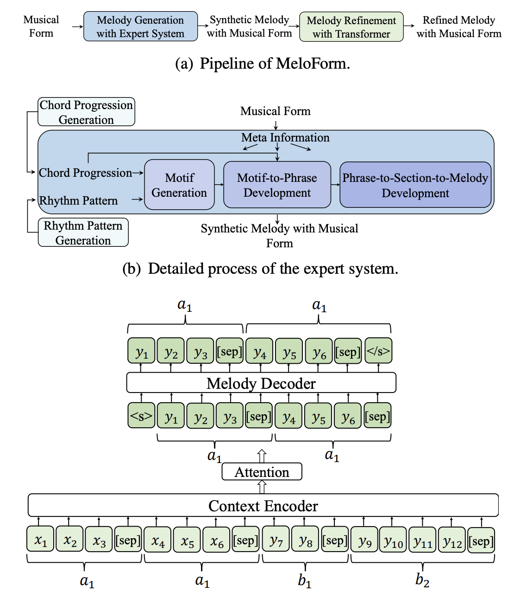

# Diffusion in ML

## Overview and Inspiration

### The goal of a diffusion model is to be able to recover useful information from a noisy source. The idea is that if we can take something and systematically apply noise, we can learn how to reverse the process form a noisy source to reconstruct something of value. Interestingly, the inspiration actually comes from thermodynamics.

More Here: [https://www.assemblyai.com/blog/diffusion-models-for-machine-learning-introduction/](https://www.assemblyai.com/blog/diffusion-models-for-machine-learning-introduction/)

### Details

You should read the note on generative models first lowkey:


[generative-models.md](generative-models.md)


We start with the idea of using a denoising autencoder:

.png>)

We see that this is too hard in practice; it doesn't work well because all noise is added at once. This leads us to the second idea, which is to incrementally add noise and learn many stages of denoising so that we don't have to recover everything at once:

.png>)

This is getting closer, but it turns out it still doesn't work. Why? All the denoising happens at the last timestep (first encoder-decoder), the rest is effectively no random. So what do we try next? Add noise during training!&#x20;

#### Variational Auto Encoders (VAE)

We saw that repeated denoising doesn't exactly work -> it leads to blurry, bad outputs. Our idea is the VAE. Another problem that we must address is that we don't know what distribution to draw from to put into the decoder. Our hack is to make the input to the decoder z be part of a known distribution. The steps we follow are:

1. Make input actually random during training
2. Add a loss term on the dist z to make it "look" more like our desired dist
3. Paramaterize so that we can use SGD (or other gradient based algorithms)

For our desired distribution, we want it to be continuous, easy to sample from, and easy to compute loss. Naturally, we will use the standard normal (multivariate) distribution.

The next question is, how do we compare two distributions? In other words, how do we compute the loss in part 2 of the steps above? One loss function we can use is known as KL Divergence:

In the bottom line we can observe the KL Divergence of our sample distribution Q and standard normal. TBH deriving this equation is a pain, but the important part is that we get something pretty easy to use in gradient based methods -- pytorch won't give a singular hoot about this. Now, we must parameterize Q so that gradient methods work. Luckily, normal distributions are defined completely by the first two moments, so all we need to do is learn the mean and covariance matrix (square root covariance matrix for computation purposes). Overall, our new picture of a variational autoencoder looks like this:

.png>)

#### Diffusion

.png>)

Diffusion takes concepts from VAEs and also from the iterative denoising process we've seen before.  In the forward process we start with real samples and iteratively add noise:

.png>)

The mean and variance are scaled s.t. overtime the sample converges to an isotropic gaussian as seen in the image above. In the reverser process our task is to take an isotropic gaussian and iteratively denoise it to look like the original sample. We denoise the sample at step t to recover the sample at t-1. At each step we want to learn a distribution, so we can use any method to maximize the evidence lower bound, such as variational audoencoders (we must use a lower bound because the approximation step is intractable otherwise.

