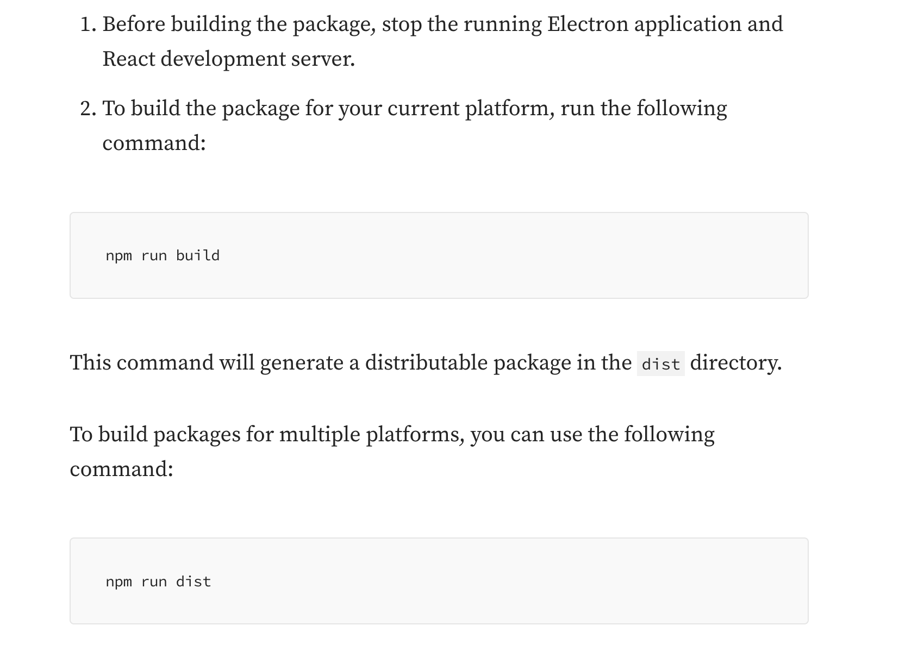

# Meloform



### Notes:

*   Process

    * Module 1 - Expert systems for generating synthetic melodies with musical forms
      * Step 1 - Motif generation
        * Use musical metadata to develop rule based algorithms that guide chord generation used to choose pitch and rhythm generation
        * Add embellishing tone to decorate the melody
      * Step 2 - Motif to phrase development
        * Develop sequence, transition and ending
      * Step 3 Phrase to section to melody development
        * Using phrases, arrange with repetition and variation to form sections
        * Organize sections sequentially to complete composition
        * To enhance musical expressiveness, adjust to make similarity and contrast between motifs
    * Module 2 - Transformer based neural networks for refining the generated melodies from expert systems
      * Refining melody phrases by phrases
      * Refining phrases by conditioning on rhythm and harmony
      * Refining phrases by considering their differentiations among different sections
      * Iterative Phrase Refinement
      * Condition with Rhythm and Harmony
      * Differentiation between Sections
    * Models
      * Transformer with selective masking depending on task
        * mask melody, position
        * replace with rhythm, chord and cadence tokens
      * Introduce PITCH AVE and SPAN tokens for pitch range control
    * Architecture overview:

    <figure><figcaption></figcaption></figure>

